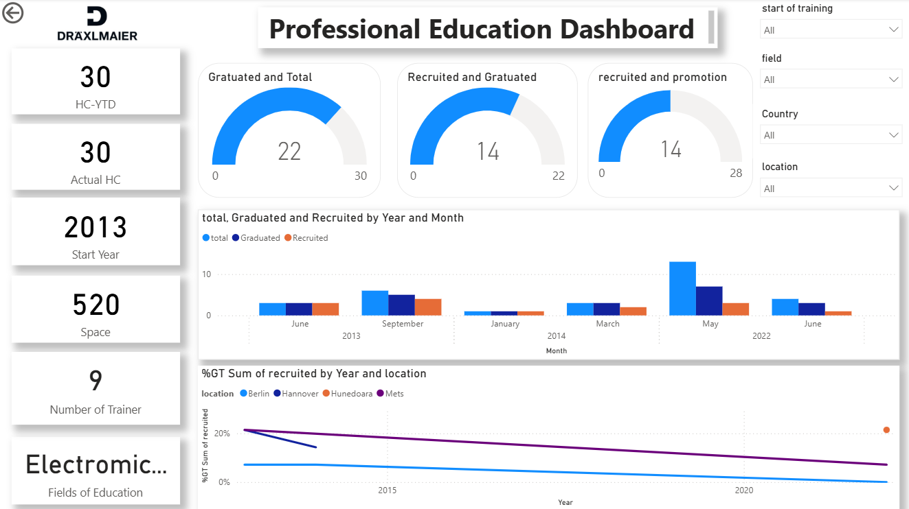

# 📊 Draexlmaier Training Analytics Dashboard  

## 📌 Project Overview  
This project was developed during my internship at **Dräexlmaier Sousse – Professional Education Center**.  
The objective was to design and implement a **Power BI dashboard** to analyze training participation across Draexlmaier sites in **Africa and Europe**, providing management with dynamic KPIs and actionable insights.  

The dashboard tracks:  
- **Headcount & Actual Headcount** of students by country, location, and training year  
- **Training Coverage & Participation Rate**  
- **Historical benchmarking** using training start hierarchies (Year, Month)  
- **Global vs. regional views** with interactive filters (country, field, location, and start of training)   

---

## ⚙️ Tools & Technologies  
- **Power BI** – dashboard design and interactive visualizations  
- **DAX** – custom measures and KPIs   
- **Excel / Data Modeling** – data preparation and integration  

---

## 🔒 Data Disclaimer  
To respect confidentiality, **the original Draexlmaier dataset is private and cannot be shared**.  
The file included in this repository is a **dummy dataset** created **only for demonstration purposes** to showcase the dashboard structure and functionalities.  

---

## 🚀 Key Impact  
- **50% reduction in manual reporting time** through automation  
- **Real-time visibility** into training activities across multiple sites  
- **Data-driven decision support** for student development and recruitment strategies  

---

## 👩‍💻 Author  
**Nada Ammar**  
Intern – Data Analytics | Dräexlmaier Sousse (Professional Education Center)  
